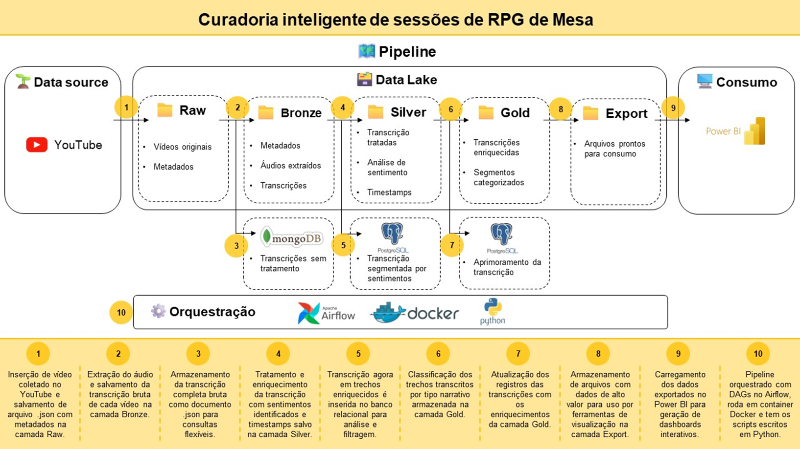

# Curadoria inteligente de sessões de RPG de Mesa

Projeto para portfólio de Engenharia de Dados 
Autoria de [José Henrique de Oliveira](https://www.linkedin.com/in/jholiveira94/) 
Orientado por [Pedro Fogaça](https://www.linkedin.com/in/pedrohfogacas/)
  

## Sumário
- [Sobre o projeto](#sobre-o-projeto)
    - [Problema enfrentado](#problema-enfrentado)
    - [Solução proposta](#solução-proposta)
- [Sobre a solução](#sobre-a-solução)
    - [Pipeline v.01](#pipeline-v01)
  

## Sobre o projeto
Com esse projeto, tenho o objetivo de auxiliar criadores de conteúdo e editores de vídeo que trabalhem com gravações de sessões de RPG de Mesa, deixando o processo de gerar cortes, resumos ou trailers mais ágil e eficiente.

### Problema enfrentado
    Campanhas de RPG costumam ser longas e complexas, tornando a curadoria manual um processo demorado e pouco escalável, deixando lenta a criação de materiais promocionais frente às altas exigências por consistência, volume e engajamento impostas por plataformas de distribuição de conteúdo digital.

### Solução proposta
    Visando a curadoria, proponho um dashboard interativo em que momentos de maior carga emocional estarão destacados.
    Para produzir esse dashboard, será necessária uma análise de sentimentos a partir da transcrição das conversas durante as sessões.

Espero que essa solução ajude a:
- Reduzir drasticamente o tempo de análise manual.
- Facilitar a identificação de momentos marcantes.
- Apoiar decisões criativas com base em dados emocionais.
- Aumentar a produtividade e a qualidade da curadoria.
- Ajudar a gerar novas ideias de conteúdo com potencial de engajamento.

## Sobre a solução
Para a execução do dashboard para curadoria, será necessário construir um pipeline que parta do conteúdo original em vídeo e entregue a análise de sentimentos tabelada.

### Pipeline v.01

Para essa solução, proponho:
- Data Lake com arquitetura medallion: 
    Cada etapa do processamento terá seus respectivos arquivos separados, dando segurança em caso de perdas em qualquer momento do pipeline, retomando o projeto com mais facilidade.

- Banco de dados relacional para armazenamento de dados prontos para uso: 
    Nesse projeto, os dados tratados serão conectados ao PowerBI, mas poderão ser usados em análises com outras ferramentas e por outros profissionais de forma facilitada por estarem em um banco de dados.

- Banco de dados NoSQL para dados não estruturados: 
    Assim como será feito com os dados já tratados, as transcrições que são dados ainda sem estrutura, mas ricos em informações, serão armazenadas em banco de dados para facilitar seu uso no próprio pipeline quanto em momentos futuros.

- Padronização das ferramentas: 
    Preocupando-me com a quebra de ferramentas, tanto pela diferença de configuração entre máquinas quanto por atualizações de pacotes usados, escolhi a solução de contêineres do Docker para estruturar o projeto.